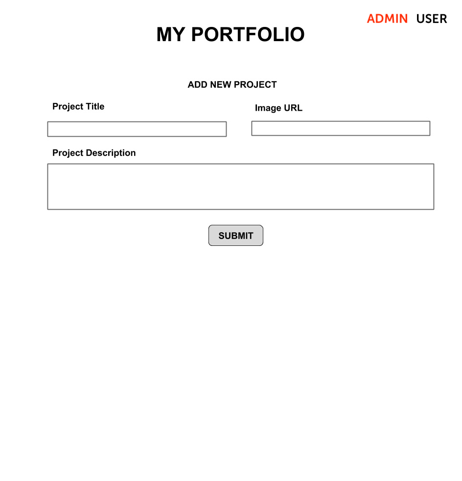
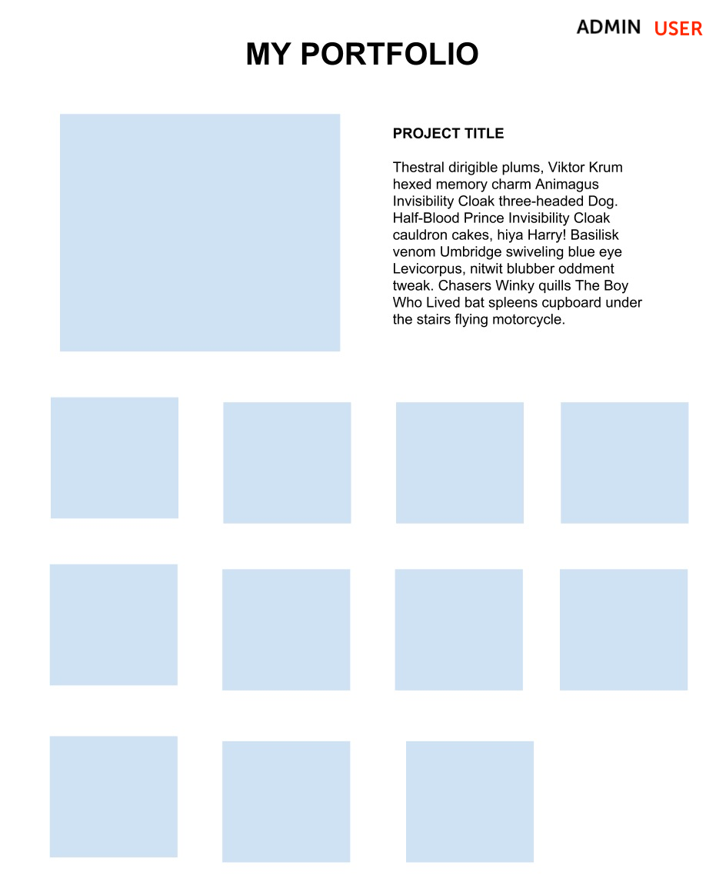

# Vue

In this repository, you will use Vue to build a SPA (Single Page Application).

## Objectives

- Use Vue components to build a website portfolio.
- Pass props to child components and propogate changes back up to parent components.
- Use state to respond to changes.

## Setup & Run

1. Type `npm install` to install packages.
1. Type `npm run dev` to run the development server.
1. Point your browser at `http://localhost:3000`.

## Basic Requirements

### 1. Add two views - one for the user and one for the admin

- [ ] Add functionality.
  - Clicking on "Admin" should show the admin view, and clicking on "User" should show the user view. This is already done for you: your job is to understand how it is done, how components are connected.
- [ ] Add styling.
  - The current page the user is on should be clear. Add some conditional styling to the button elements to show this.

### 2. Admin view - create a form that adds images to the page.

- [ ] Add functionality.
  - This form should accept a URL, a description, and a title.
  - This form should have a "submit" button.
  - After clicking the button, the image should appear on the page in the user view.
- [ ] Add styling.
  - Everything should be center-aligned. See attached design.

### 3. User view - show images of all projects, and update featured project when clicked.

- [ ] Add functionality
  - Add at least three default images.
  - Add an event listener on each image element on your page. When the image is clicked, it should replace the featured image at the top of the page.
  - Clicking on other images should remove the current featured image and append a new one.
  - The featured image should contain the image, title, and description.
  - Use the first project as the default featured project.
- [ ] Add styling.
  - All images should be the same width, with padding in between.
  - Images should be positioned in a grid pattern so that they appear approximately four across when the browser window is full size (but this should be responsive– so less items appear across as the browser window gets smaller).
  - The featured image should be on the left, and the title and description should be on the right.

### 4. Improve styling

- [ ] Play with the styling so this looks as professional as possible!

## Resources

- [Vue docs - single file components](https://vuejs.org/guide/scaling-up/sfc.html)
- [Vue docs - components](https://vuejs.org/guide/essentials/component-basics.html)

## Notes

_This is a student project that was created at [CodeOp](http://CodeOp.tech), a full stack development bootcamp in Barcelona._
